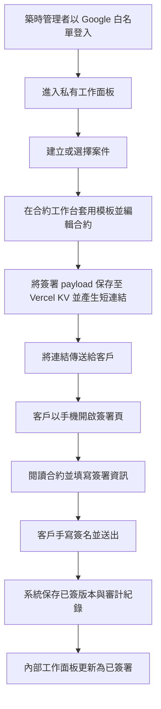

## 1. 產品概述
築時數位工作面板是一套僅供內部使用的案件營運系統，負責管理詢問、案件、報價、合約、簽署與歷史留存；客戶則透過專屬簽署網址，在手機上完成合約閱讀與簽署。
- 主要目的是把公開官網與內部營運流程拆開，避免敏感資料與公開品牌站混雜，並提升築時數位的接案作業效率與法務防禦力。
- 目標價值是建立可持續擴充的「築時數位標準接案作業系統」，讓案件從詢問到簽約都有一致流程與留痕。

## 2. 核心功能

### 2.1 使用者角色
| 角色 | 登入方式 | 核心權限 |
|------|----------|----------|
| 築時管理者 | Google 白名單登入 | 管理案件、建立合約、產生簽署連結、查看已簽紀錄 |
| 客戶簽署者 | 免登入，持 token 開啟簽署頁 | 閱讀指定合約、填寫簽署資訊、完成簽名送出 |

### 2.2 功能模組
1. **內部總覽頁**：案件摘要、待簽合約、待收款提醒、近期活動紀錄。
2. **案件管理頁**：客戶資料、案件狀態、報價/合約綁定、備註與里程碑。
3. **合約工作台**：套用模板、編輯條款、設定付款節點、產生簽署連結。
4. **客戶簽署頁**：手機友善閱讀、簽署確認、手寫簽名、送出完成。
5. **已簽留存頁**：已簽合約列表、單筆詳情、版本快照、簽署證據。
6. **模板管理頁**：維護築時數位標準合約條款、付款方案與條款片段。
7. **登入與權限保護**：僅允許 Google 白名單帳號登入內部工作面板；客戶簽署頁仍以 token 方式匿名存取。

### 2.3 頁面詳情
| 頁面名稱 | 模組名稱 | 功能說明 |
|-----------|-------------|---------------------|
| 內部總覽頁 | 儀表卡片 | 顯示進行中案件數、待簽合約數、待付款節點、最近活動 |
| 內部總覽頁 | 快速入口 | 快速建立案件、建立合約、查看已簽記錄 |
| 案件管理頁 | 案件列表 | 依狀態、客戶、日期篩選案件 |
| 案件管理頁 | 案件詳情 | 編輯客戶資訊、專案摘要、時程、內部備註 |
| 合約工作台 | 基本資料表單 | 甲乙方資料、專案名稱、總價、付款比例、交付日期 |
| 合約工作台 | 條款組裝器 | 套用築時數位防禦型條款，可局部調整欄位值 |
| 合約工作台 | 簽署設定 | 產生 token 連結、設定簽署期限、查看分享狀態 |
| 客戶簽署頁 | 合約閱讀區 | 顯示最終合約內容、付款節點、雙方資訊 |
| 客戶簽署頁 | 確認與簽名區 | 勾選同意、填姓名/Email/電話、手寫簽名 |
| 客戶簽署頁 | 送出完成區 | 顯示成功訊息與已簽摘要 |
| 已簽留存頁 | 已簽列表 | 顯示所有已完成簽署的合約與狀態 |
| 已簽留存頁 | 詳細紀錄 | 顯示簽署時間、IP、User Agent、文件版本、簽名圖 |
| 模板管理頁 | 條款模板管理 | 維護標準修改次數、Ghosting、Kill Fee 等條款 |
| 登入入口頁 | Google 登入 | 僅允許築時數位白名單帳號登入，未授權帳號拒絕進入工作面板 |

## 3. 核心流程
築時管理者需先以 Google 白名單帳號登入內部工作面板，通過後才能查看案件、建立合約或產生簽署連結。合約工作台完成後，系統會將簽署 payload 與最終留存記錄保存到 Vercel KV，並產生正式短連結給客戶。客戶在手機上開啟簽署頁，閱讀合約內容、填寫簽署資訊並完成手寫簽名。系統保存已簽版本與簽署證據，內部工作面板同步更新合約狀態。

## 4. 使用者介面設計
### 4.1 設計風格
- 主色系：燕麥白、暖石灰、鼠尾草綠、墨黑，延續築時數位既有 Japandi 調性
- 輔助色：陶土棕、柔霧金，用於重要狀態與法律文件層級強調
- 按鈕風格：大圓角、霧面材質、明確 hover 與按下層次
- 字體：中文正文採 Noto Sans TC，標題採 Noto Serif TC 或高辨識襯線字體
- 版面風格：桌機優先的編輯工作台，搭配安定留白、卡片群組、文件式版面
- 圖示風格：簡潔線性圖示，避免過度科技感，維持專業法律與品牌編輯感

### 4.2 頁面設計總覽
| 頁面名稱 | 模組名稱 | UI 元素 |
|-----------|-------------|-------------|
| 內部總覽頁 | 儀表卡片 | 大型數值、狀態標籤、近期事件時間軸 |
| 案件管理頁 | 案件列表 | 表格式卡片、篩選器、狀態膠囊、快速操作按鈕 |
| 合約工作台 | 合約編輯區 | 左側表單、右側合約預覽、分段條款卡片、黏性工具列 |
| 客戶簽署頁 | 簽署主視圖 | 單欄閱讀、手機友善字級、分段條款、固定底部送出區 |
| 已簽留存頁 | 紀錄詳情 | 文件摘要卡、簽名圖卡、審計資訊區塊、列印樣式 |
| 模板管理頁 | 模板編輯器 | 條款片段列表、排序拖曳區、預覽面板 |

### 4.3 響應式策略
- 採桌機優先設計，內部工作面板最佳使用環境為桌機與筆電
- 客戶簽署頁需特別優化手機操作，確保單手滑動與手指簽名流暢
- 平板視圖需兼顧合約閱讀與簽名操作
- 重要按鈕、欄位與簽名區在手機上需保留足夠觸控面積
