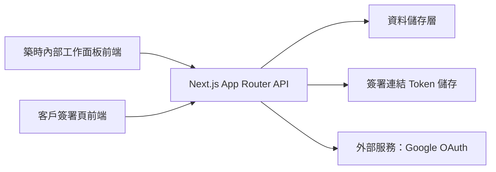
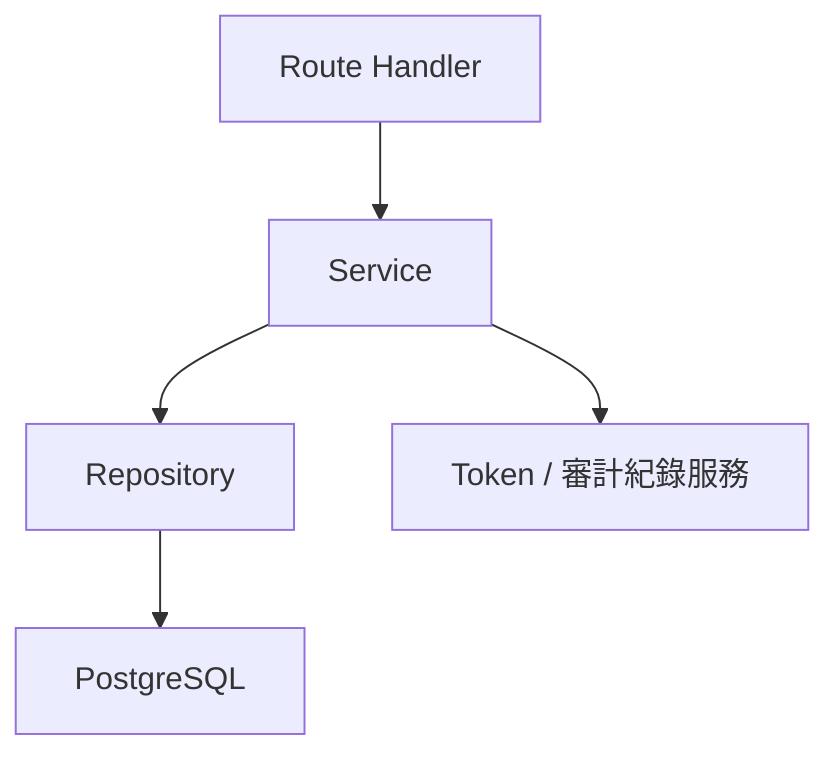
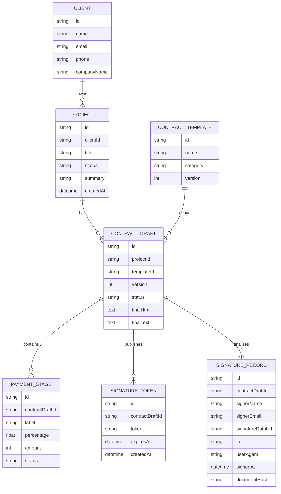

## 1. 架構設計


## 2. 技術說明
- 前端：Next.js 16 + React 19 + Tailwind CSS 4
- 後端：Next.js Route Handlers
- 驗證：Google OAuth 白名單登入
- 資料層：建議採 PostgreSQL + ORM
- 簽署儲存：資料庫保存合約草稿、最終快照、簽署紀錄與 token
- 部署：Vercel，工作面板建議獨立為第二個專案或獨立子網域

## 3. 路由定義
| 路由 | 用途 |
|-------|---------|
| /login | 築時管理者登入頁 |
| /studio | 內部總覽儀表板 |
| /studio/projects | 案件列表頁 |
| /studio/projects/[projectId] | 單一案件詳情頁 |
| /studio/contracts | 合約列表頁 |
| /studio/contracts/new | 建立新合約頁 |
| /studio/contracts/[contractId] | 合約工作台與預覽頁 |
| /studio/templates | 合約模板管理頁 |
| /studio/records | 已簽留存列表頁 |
| /studio/records/[recordId] | 已簽合約詳細頁 |
| /sign/[token] | 客戶外部簽署頁 |

## 4. API 定義
```ts
type UserRole = "admin";

type ProjectStatus =
  | "lead"
  | "qualified"
  | "proposal_sent"
  | "contract_pending"
  | "signed"
  | "in_progress"
  | "completed"
  | "archived";

type PaymentStage = {
  id: string;
  label: string;
  percentage: number;
  amount: number;
  dueRule: string;
  status: "pending" | "paid" | "overdue";
};

type ContractClause = {
  id: string;
  title: string;
  content: string;
  isRequired: boolean;
  order: number;
};

type ContractDraft = {
  id: string;
  projectId: string;
  templateId: string;
  title: string;
  version: number;
  clientName: string;
  clientEmail: string;
  clientPhone: string;
  totalAmount: number;
  paymentStages: PaymentStage[];
  clauses: ContractClause[];
  finalHtml: string;
  finalText: string;
  status: "draft" | "sent" | "signed" | "expired";
};

type SignatureSubmission = {
  signerName: string;
  signerEmail: string;
  signerPhone: string;
  signerRole: string;
  signatureDataUrl: string;
  agreedToTerms: boolean;
};
```

| API | 方法 | 用途 |
|-----|------|------|
| /api/auth/session | GET | 取得目前登入者資訊 |
| /api/projects | GET | 取得案件列表 |
| /api/projects | POST | 建立新案件 |
| /api/projects/[projectId] | PATCH | 更新案件資料 |
| /api/contracts | GET | 取得合約列表 |
| /api/contracts | POST | 建立合約草稿 |
| /api/contracts/[contractId] | GET | 取得單一合約內容 |
| /api/contracts/[contractId] | PATCH | 更新合約草稿 |
| /api/contracts/[contractId]/share | POST | 產生或重新產生簽署 token |
| /api/sign/[token] | GET | 讀取對外簽署內容 |
| /api/sign/[token] | POST | 提交客戶簽署結果 |
| /api/records | GET | 取得已簽留存列表 |
| /api/records/[recordId] | GET | 取得已簽詳細記錄 |

## 5. 伺服器架構圖


## 6. 資料模型
### 6.1 資料模型定義


### 6.2 資料定義語言
```sql
CREATE TABLE clients (
  id UUID PRIMARY KEY,
  name VARCHAR(120) NOT NULL,
  email VARCHAR(160) NOT NULL,
  phone VARCHAR(40),
  company_name VARCHAR(160),
  created_at TIMESTAMP NOT NULL DEFAULT NOW()
);

CREATE TABLE projects (
  id UUID PRIMARY KEY,
  client_id UUID NOT NULL REFERENCES clients(id),
  title VARCHAR(180) NOT NULL,
  status VARCHAR(40) NOT NULL,
  summary TEXT,
  created_at TIMESTAMP NOT NULL DEFAULT NOW()
);

CREATE TABLE contract_templates (
  id UUID PRIMARY KEY,
  name VARCHAR(180) NOT NULL,
  category VARCHAR(80) NOT NULL,
  version INTEGER NOT NULL DEFAULT 1,
  content_json JSONB NOT NULL,
  created_at TIMESTAMP NOT NULL DEFAULT NOW()
);

CREATE TABLE contract_drafts (
  id UUID PRIMARY KEY,
  project_id UUID NOT NULL REFERENCES projects(id),
  template_id UUID NOT NULL REFERENCES contract_templates(id),
  version INTEGER NOT NULL DEFAULT 1,
  status VARCHAR(40) NOT NULL,
  final_html TEXT NOT NULL,
  final_text TEXT NOT NULL,
  created_at TIMESTAMP NOT NULL DEFAULT NOW(),
  updated_at TIMESTAMP NOT NULL DEFAULT NOW()
);

CREATE TABLE payment_stages (
  id UUID PRIMARY KEY,
  contract_draft_id UUID NOT NULL REFERENCES contract_drafts(id),
  label VARCHAR(120) NOT NULL,
  percentage NUMERIC(5,2) NOT NULL,
  amount INTEGER NOT NULL,
  status VARCHAR(40) NOT NULL
);

CREATE TABLE signature_tokens (
  id UUID PRIMARY KEY,
  contract_draft_id UUID NOT NULL REFERENCES contract_drafts(id),
  token VARCHAR(120) NOT NULL UNIQUE,
  expires_at TIMESTAMP,
  created_at TIMESTAMP NOT NULL DEFAULT NOW()
);

CREATE TABLE signature_records (
  id UUID PRIMARY KEY,
  contract_draft_id UUID NOT NULL REFERENCES contract_drafts(id),
  signer_name VARCHAR(120) NOT NULL,
  signer_email VARCHAR(160) NOT NULL,
  signer_phone VARCHAR(40),
  signature_data_url TEXT NOT NULL,
  ip VARCHAR(80),
  user_agent TEXT,
  document_hash VARCHAR(128) NOT NULL,
  signed_at TIMESTAMP NOT NULL DEFAULT NOW()
);

CREATE INDEX idx_projects_client_id ON projects(client_id);
CREATE INDEX idx_contract_drafts_project_id ON contract_drafts(project_id);
CREATE INDEX idx_signature_tokens_token ON signature_tokens(token);
CREATE INDEX idx_signature_records_contract_draft_id ON signature_records(contract_draft_id);
```
